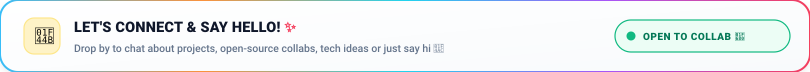

<!-- Animated Drop + Water Ripple Header -->

<!-- Typing animation -->

 

<!-- Profile badges -->

---

## 🧠 About Me

<!-- BANNER - terminal profile.sh --live (animated). Generated by scripts/banner/generate.py.
     ~800 KB each. Place your photo at assets/source/photo.png and re-run to get dot-matrix portrait. -->

<picture>
  <source media="(prefers-color-scheme: dark)"  srcset="assets/banner-dark.svg">
  <source media="(prefers-color-scheme: light)" srcset="assets/banner-light.svg">
  
</picture>

---

## 🚀 Featured Projects

| 🌾 KisanDB | 🚑 SmartCare |
|:---:|:---:|
| AI-powered farming platform for India | AI emergency response platform |
| ML price prediction (88.67% accuracy) | One-touch SOS + Live GPS + Drone support |
| Real-time weather advisories | Telemedicine + Doctor/Ambulance connection |
| `Python` `ML` `AI` | `HTML` `GPS` `AI` |
| [View Repo →](https://github.com/1Nilesh0837/kisandb) | [View Repo →](https://github.com/1Nilesh0837/SmartCare) |

---

## 💼 Tech I Work With

### 🤖 AI / Machine Learning & Computer Vision

  

 

### 📊 Data & Analytics

  &nbsp;
  &nbsp;
  &nbsp;
  &nbsp;
  

 

### 🌐 Frontend & Mobile Development

  

 

### ⚙️ Languages & Tools

  

---

## ⚡ GitHub Telemetry & Stats

<!-- GitHub Trophies -->

  

<!-- Stats & Streak Side-by-Side (Matching 195px Height & Cyberpunk Theme) -->

&nbsp;&nbsp;

  

<!-- Top Languages Card -->

---

## 🎮 Contribution Grid · Pac-Man Edition

---

## 🌸 Connect & Say Hello · Bento Cards

  
  

  
  

  

---

<!-- Retro Arcade Game Footer -->

 

**"Code is the modern sorcery: turning pure imagination into reality, one commit at a time."** 🌌✨

*If my work inspired you, drop a ⭐ on my repos — it fuels the next mission!* 🚀

