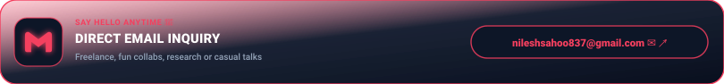

<!-- Animated Drop + Water Ripple Header -->

<!-- Typing animation -->

 

<!-- Profile badges -->

---

## 🧠 About Me

<!-- BANNER - terminal profile.sh --live (animated). Generated by scripts/banner/generate.py.
     ~800 KB each. Place your photo at assets/source/photo.png and re-run to get dot-matrix portrait. -->

---

## 🚀 Featured Projects · Auto-Synced

<!-- FEATURED_PROJECTS:START -->

  
  &nbsp;
  <em><b>📡 Live Repository Feed · Automatically updates whenever a new project is uploaded</b></em>

&nbsp;

<!-- FEATURED_PROJECTS:END -->

---

## 💼 Tech I Work With · Cyber Stack

  <code>SYSTEM ARSENAL</code> &nbsp; <b>High-Performance Machine Learning, Big Data & Full-Stack Infrastructure</b>

 

<!-- 01: AI & Machine Learning -->

  
    
  

 

<!-- 02: Data & Analytics -->

  
    
  &nbsp;
  &nbsp;
  &nbsp;
  &nbsp;
  

 

<!-- 03: Frontend & Mobile -->

  
    
  

 

<!-- 04: Systems & Tools -->

  
    
  

---

## ⚡ GitHub Stats · Cyber Telemetry

---

## 🎮 Contribution Grid · Pac-Man Edition

---

## 🌐 Connect & Say Hello · Bento Cards

  
  

  
  

  

---

<!-- Cyber Synthwave Highway Cruise Footer -->

 

**"Code with passion, cruise beyond the limits — never stop building."** 🏎️⚡✨

*If my work inspired you, drop a ⭐ on my repos — it keeps the journey going!* 🌟

